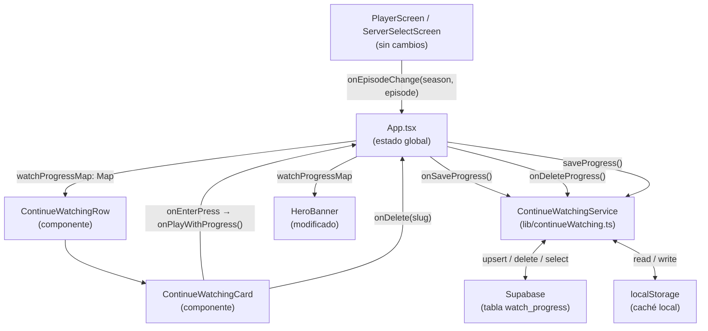

# Diseño: Continuar Viendo

## Visión General

La funcionalidad "Continuar Viendo" agrega persistencia de progreso de reproducción a la app de TV. El diseño se integra con la arquitectura existente: `App.tsx` como orquestador de estado, `ContentRow` como componente de fila reutilizable, y `@noriginmedia/norigin-spatial-navigation` para la navegación con control remoto.

El flujo principal es:
1. El usuario inicia reproducción → `ContinueWatchingService.save()` persiste en Supabase + localStorage
2. Al cargar la app → el servicio carga los registros y los expone como estado en `App.tsx`
3. La `ContinueWatchingRow` renderiza los contenidos en progreso con tarjetas especializadas
4. Al seleccionar un item → se retoma desde la temporada/episodio guardados

---

## Arquitectura



### Decisiones de diseño

- **`ContinueWatchingService` como módulo puro** (no hook): facilita el testing unitario sin necesidad de renderizar componentes React.
- **`watchProgressMap: Map<slug, WatchProgress>`** en `App.tsx`: permite lookups O(1) por slug para el HeroBanner y las tarjetas.
- **`ContinueWatchingRow` reutiliza `ContentRow`** internamente para mantener consistencia visual y de navegación espacial.
- **`ContinueWatchingCard` extiende `AssetCard`** con un overlay de indicador de progreso y un overlay de confirmación de eliminación.
- **localStorage como caché**: se escribe en cada operación y se lee al iniciar para mostrar datos inmediatamente antes de que Supabase responda.

---

## Componentes e Interfaces

### `ContinueWatchingService` (`src/lib/continueWatching.ts`)

```typescript
export interface WatchProgress {
  id?: string;
  user_id: string;
  slug: string;
  content_type: 'movie' | 'series';
  season?: number;
  episode?: number;
  updated_at: string; // ISO 8601
  completed: boolean;
}

// Guarda o actualiza el progreso de un contenido
export async function saveProgress(progress: Omit<WatchProgress, 'id' | 'updated_at'>): Promise<void>

// Elimina el progreso de un contenido
export async function deleteProgress(userId: string, slug: string): Promise<void>

// Carga todos los registros en progreso del usuario (completed: false)
export async function loadProgress(userId: string): Promise<WatchProgress[]>

// Lee el caché local
export function readLocalCache(userId: string): WatchProgress[]

// Escribe el caché local
export function writeLocalCache(userId: string, items: WatchProgress[]): void
```

**Clave de localStorage**: `watch_progress_${userId}`

**Upsert Supabase**: usa `onConflict: 'user_id,slug'` para garantizar un único registro por usuario+contenido.

---

### `ContinueWatchingRow` (`src/components/ContinueWatchingRow/ContinueWatchingRow.tsx`)

```typescript
interface ContinueWatchingRowProps {
  items: WatchProgress[];                          // registros en progreso
  assetsMap: Map<slug, Asset>;                     // para obtener título/imagen
  onPlayWithProgress: (asset: Asset, progress: WatchProgress) => void;
  onDelete: (slug: string) => void;
  onFocus: (layout: FocusableComponentLayout, props: object, details: FocusDetails) => void;
}
```

- Usa `useFocusable` + `FocusContext` igual que `ContentRow`
- Se oculta completamente (`return null`) cuando `items.length === 0`
- Renderiza `ContinueWatchingCard` por cada item
- Scroll horizontal con `tvScrollTo` al enfocar una tarjeta

---

### `ContinueWatchingCard` (`src/components/ContinueWatchingRow/ContinueWatchingCard.tsx`)

```typescript
interface ContinueWatchingCardProps {
  asset: Asset;
  progress: WatchProgress;
  onPlay: (asset: Asset, progress: WatchProgress) => void;
  onDelete: (slug: string) => void;
  onFocus: (layout: FocusableComponentLayout) => void;
}
```

**Estados internos**:
- `focused` (de `useFocusable`)
- `showDeleteConfirm: boolean` — overlay de confirmación de eliminación

**Teclas manejadas** (via `onKeyDown` en el elemento focusable):
- `Enter` → `onPlay(asset, progress)`
- `keyCode 18` (tecla Menú Samsung/LG) → `setShowDeleteConfirm(true)`
- Cuando `showDeleteConfirm`:
  - `Enter` → `onDelete(slug)`
  - `Escape` / `Backspace` → `setShowDeleteConfirm(false)`

**Overlay de indicador** (siempre visible sobre la imagen):
- Series: badge `"T{season}:E{episode}"` en esquina superior izquierda
- Películas: badge `"En progreso"` en esquina superior izquierda

**Overlay de confirmación** (visible cuando `showDeleteConfirm`):
- Texto: `"¿Eliminar de Continuar Viendo?"`
- Botones: `"Sí, eliminar"` / `"Cancelar"`

---

### Modificaciones a `HeroBanner`

Se agrega la prop `watchProgressMap`:

```typescript
interface HeroBannerProps {
  // ... props existentes ...
  watchProgressMap?: Map<string, WatchProgress>;
}
```

Lógica del texto del botón de reproducción:

```typescript
const progress = watchProgressMap?.get(displayAsset.id);
const playLabel = progress
  ? (displayAsset.isSeries
      ? `▶ Continuar T${progress.season}:E${progress.episode}`
      : '▶ Continuar')
  : (displayAsset.isSeries ? '▶ Ver T1:E1' : '▶ Reproducir');
```

Al presionar el botón "Continuar" para una serie, se llama `onPlayPress(asset)` pero `App.tsx` usa el `watchProgressMap` para pasar `season` y `episode` al `ServerSelectScreen`.

---

### Modificaciones a `App.tsx`

Nuevo estado:

```typescript
const [watchProgressMap, setWatchProgressMap] = useState<Map<string, WatchProgress>>(new Map());
```

Nuevo callback `onSaveProgress`:

```typescript
const onSaveProgress = useCallback(async (
  asset: Asset,
  season?: number,
  episode?: number
) => {
  const { data: { user } } = await supabase.auth.getUser();
  if (!user) return;
  const progress: Omit<WatchProgress, 'id' | 'updated_at'> = {
    user_id: user.id,
    slug: asset.id,
    content_type: asset.isSeries ? 'series' : 'movie',
    season,
    episode,
    completed: false,
  };
  await saveProgress(progress);
  setWatchProgressMap(prev => new Map(prev).set(asset.id, {
    ...progress,
    updated_at: new Date().toISOString(),
  }));
}, []);
```

`onSaveProgress` se llama desde `onSelectServer` (al iniciar reproducción) y cuando el usuario cambia de episodio en `PlayerScreen`.

---

## Modelos de Datos

### Tabla Supabase `watch_progress`

```sql
CREATE TABLE watch_progress (
  id          UUID PRIMARY KEY DEFAULT gen_random_uuid(),
  user_id     UUID NOT NULL REFERENCES auth.users(id) ON DELETE CASCADE,
  slug        TEXT NOT NULL,
  content_type TEXT NOT NULL CHECK (content_type IN ('movie', 'series')),
  season      INTEGER,
  episode     INTEGER,
  updated_at  TIMESTAMPTZ NOT NULL DEFAULT now(),
  completed   BOOLEAN NOT NULL DEFAULT false,
  UNIQUE (user_id, slug)
);

-- RLS: cada usuario solo ve sus propios registros
ALTER TABLE watch_progress ENABLE ROW LEVEL SECURITY;
CREATE POLICY "Users can manage their own watch progress"
  ON watch_progress FOR ALL
  USING (auth.uid() = user_id);
```

### Tipo `WatchProgress` (TypeScript)

```typescript
export interface WatchProgress {
  id?: string;
  user_id: string;
  slug: string;
  content_type: 'movie' | 'series';
  season?: number;    // solo para series
  episode?: number;   // solo para series
  updated_at: string; // ISO 8601
  completed: boolean;
}
```

### Caché localStorage

```
Clave: "watch_progress_{userId}"
Valor: JSON.stringify(WatchProgress[])
```

---

## Propiedades de Corrección

*Una propiedad es una característica o comportamiento que debe ser verdadero en todas las ejecuciones válidas del sistema — esencialmente, una declaración formal sobre lo que el sistema debe hacer. Las propiedades sirven como puente entre las especificaciones legibles por humanos y las garantías de corrección verificables automáticamente.*

### Property 1: Guardar progreso crea un registro con campos correctos

*Para cualquier* slug, tipo de contenido, temporada y episodio válidos, guardar el progreso debe resultar en un registro en localStorage que contenga exactamente esos valores con `completed: false`.

**Validates: Requirements 1.1, 1.2, 1.6**

---

### Property 2: Actualizar progreso de episodio refleja los nuevos valores

*Para cualquier* registro WatchProgress existente de una serie, actualizar la temporada y el episodio debe resultar en que el registro en localStorage contenga los nuevos valores de `season` y `episode`, no los anteriores.

**Validates: Requirements 1.3**

---

### Property 3: Upsert es idempotente por (user_id, slug)

*Para cualquier* slug y usuario, guardar el mismo slug dos veces con distintos valores de `season`/`episode` debe resultar en exactamente un registro en localStorage (no duplicados), con los valores de la segunda escritura.

**Validates: Requirements 6.2, 1.1, 1.2**

---

### Property 4: Sincronización localStorage refleja datos remotos

*Para cualquier* lista de registros WatchProgress cargados desde Supabase, después de la sincronización el localStorage debe contener exactamente esos registros (ni más ni menos).

**Validates: Requirements 6.5, 1.6**

---

### Property 5: ContinueWatchingRow filtra y ordena correctamente

*Para cualquier* lista de registros WatchProgress con mezcla de `completed: true` y `completed: false`, la fila debe mostrar únicamente los registros con `completed: false`, ordenados por `updated_at` descendente.

**Validates: Requirements 2.1**

---

### Property 6: ContinueWatchingCard muestra el indicador correcto según tipo

*Para cualquier* asset y registro WatchProgress, la tarjeta debe mostrar:
- Si `content_type === 'series'`: el texto `"T{season}:E{episode}"` con los valores del registro
- Si `content_type === 'movie'`: el texto `"En progreso"`

**Validates: Requirements 2.4, 2.5**

---

### Property 7: Texto del botón HeroBanner es correcto según estado de progreso

*Para cualquier* asset y estado del `watchProgressMap`, el texto del botón de reproducción debe ser:
- Sin progreso + película: `"Reproducir"`
- Sin progreso + serie: `"Ver T1:E1"`
- Con progreso + película: `"Continuar"`
- Con progreso + serie: `"Continuar T{season}:E{episode}"`

**Validates: Requirements 3.1, 3.2, 3.3**

---

### Property 8: Seleccionar tarjeta de serie pasa los parámetros correctos de progreso

*Para cualquier* asset de serie y registro WatchProgress con `season` y `episode` aleatorios, al invocar `onEnterPress` en la `ContinueWatchingCard`, el callback `onPlay` debe recibir exactamente esa `season` y ese `episode`.

**Validates: Requirements 4.1, 4.4**

---

### Property 9: Eliminar un registro reduce la lista en exactamente uno

*Para cualquier* lista de registros WatchProgress con N elementos, eliminar un registro que existe en la lista debe resultar en una lista con N-1 elementos que no contiene el registro eliminado.

**Validates: Requirements 5.2, 5.3**

---

### Property 10: ContinueWatchingCard con foco tiene estilos visuales distintos

*Para cualquier* asset y registro WatchProgress, la tarjeta con `focused=true` debe tener estilos CSS distintos a la tarjeta con `focused=false` (borde blanco y escala aumentada), consistente con `AssetCard`.

**Validates: Requirements 2.7**

---

## Manejo de Errores

- **Error de red en Supabase**: `ContinueWatchingService` captura el error con `try/catch`, lo registra con `console.error`, y retorna sin lanzar. La UI no se interrumpe.
- **Usuario no autenticado**: `saveProgress` verifica `user_id` antes de operar. Si está vacío, retorna inmediatamente.
- **localStorage no disponible**: se envuelve en `try/catch`. Si falla (modo privado en algunos navegadores), se omite el caché local sin error.
- **Asset no encontrado en `assetsMap`**: `ContinueWatchingRow` filtra los items cuyo slug no tiene un Asset correspondiente antes de renderizar.

---

## Estrategia de Testing

### Testing dual: unitario + basado en propiedades

Se usa **Vitest** (ya configurado en el proyecto) con **fast-check** (ya usado en los tests existentes) para property-based testing.

**Tests unitarios** (ejemplos específicos y edge cases):
- `ContinueWatchingService`: carga inicial, error de red, usuario no autenticado
- `ContinueWatchingRow`: lista vacía → `null`, orden correcto
- `ContinueWatchingCard`: overlay de confirmación aparece/desaparece
- `HeroBanner`: texto del botón con y sin progreso

**Tests de propiedades** (universales, mínimo 100 iteraciones cada uno):
- Cada propiedad del diseño se implementa como un test de fast-check
- Los generadores usan `fc.record`, `fc.string`, `fc.integer`, `fc.boolean`
- Se mockea Supabase con `jest.mock` y localStorage con `jest.spyOn`

**Configuración de tags**:
```
Feature: continuar-viendo, Property {N}: {texto de la propiedad}
```

**Archivos de test**:
- `src/__tests__/continuewatching.service.pbt.test.ts` — Properties 1, 2, 3, 4
- `src/__tests__/continuewatching.row.pbt.test.tsx` — Properties 5, 9
- `src/__tests__/continuewatching.card.pbt.test.tsx` — Properties 6, 8, 10
- `src/__tests__/herobanner.continuewatching.pbt.test.tsx` — Property 7
